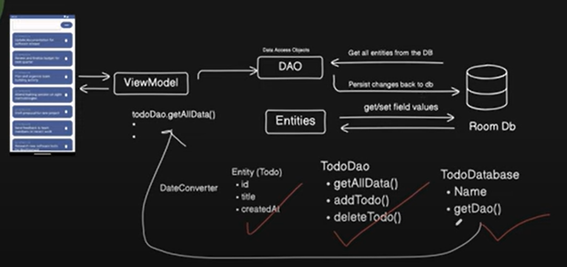

La creation d'un pétit app avec Room etait au rendevoit aujourd'hui . J'ai appris de choses tres intéressaantes 

Voisi les différentes étapes : 
db : 
- converters : Convertir les dates et d'autres formats en enformat comprehensibles pas la base de donnée 
- -TodoDao : Ce DAO est l'interface qui dévinit toutes les methodes qui seront utilisées la base de donné . Les opérations de la base de donnée  sont définies ici. 
- TodoDatabase : Definit la base de donnée , lui donne un nom et definit l'entité principale . C'est á travers elle qu'on accéde au DAO

MainApplication : On définit une nouvelle application , crée une room avec un context , la base de donnée et son nom et on la construit 

TodoViewModel : Lá on récuprer le DAO á travers la base de donnée 
Ici on implemente les méthode de suppression et d'ajout et se rassure qu'elle sont synchronisées et ne vont pas bloquer l'UI 

