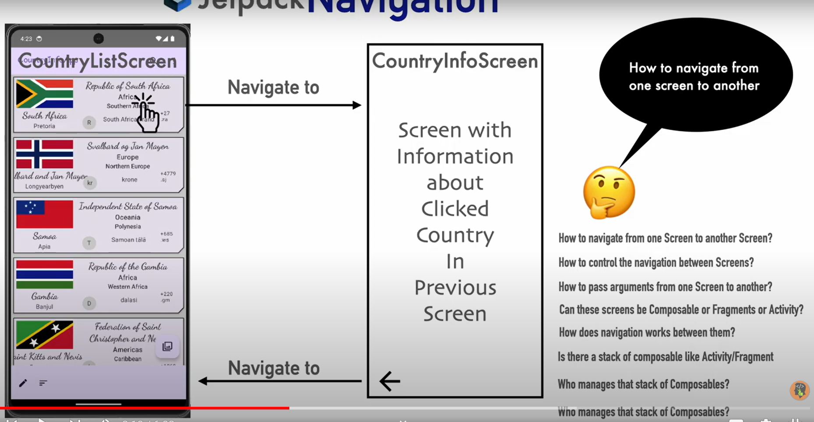
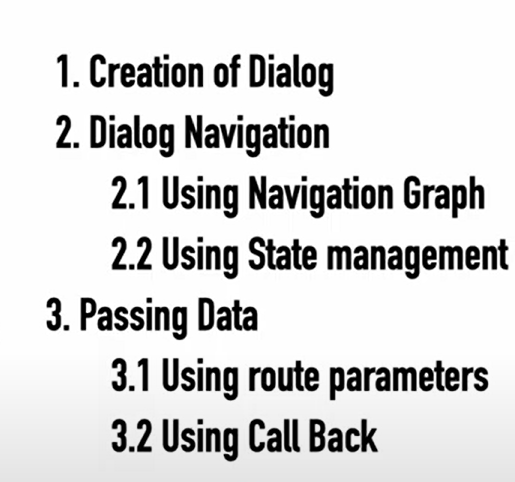

## Learning Jetpack Compose 

### First step 
We try to inject the dependences 

### Change the state of a variable 

Quand la valeur d'une vairable est changée , on doit également rappéler la function 

### Screen orientation change 
rememberSaveValue 

### Séparer la logique de la vue avec View -> ViewModel 
On utilise ici le View Model avec les liveData 

### construire une UI 

### The struction of the content 

### Using the constraint layout 

 Constraint Layout simplifie les la conception de l'interface en se focalisant plus sur les différents élements de l'interface . 
remplace Column, Row ou Box dans l'interface . 
# Modifier.constrainAs , start , end , top , buttom , 
### oDER USI Elements from ConstraintLayout 

Guidlines : Set the reference Guideline 
            Use reference guidlines to arrange Composable 
            Pass guidelines as parameters to contraintAs 

Barriers :   Use the most  extreme element in UI to create virtual guidlines 

       

Chain : Ici on utilise un groupe de layout comme reférence 

### use coil to load the image asynchron in the app 
d'autres bibliotheques sont Glide ou Picasso,

### filter , short by name , search 

### TopAppBar , Action , Scaffold , ButtonAppBar , FloatingAction Button 

### NavigationIcon , TopAppBar , ActionButtons , FixNavbar ,non  Fix Button on the screen , Buttonnavigation , ButtomBar , ButtomAppBar , floatingActionButton 

### Themes in Jetpack Compose 
Theme : fonts , color for cards , Typography , Color for Background Surface 

### Typography in jetpack compose . 

###  shape , type and theme 
on peut créer une classe et y développer des themes personels . 

### Navigation 
Toutes les questions intéressantes sont sur la photo 

Les thermes les plus importants : Navhost , NavController , NavGraph , Action , Destination 

Destination : The screens 
NavHost : Help to visit 
NavController : Is using by NavHost by the visit 
Action : Route beetween the Destionation
Navgraph : Contents all Informations and likes all the concepts 
inclusive : inclusive = false quand on veut rentrer á l'état initial 

## Utiliser le scaffold avec la navigation 
Comment utiliser la navigation et le scaffold ? 

### Comment passer les données entre deux composables ? 
On peux passer un string et le récupérer directement 

### Comment passer plutot des données objets comme du json et autres 
serialisation et deserialisation des données envoyées : Pour le faire , il faut á tous prix ajouter les dépendances et créer une classe serialisable .

### Simplification de la navigation avec le repository design pattern 

### Utiliser le viewModel pour partager des données entre différents écrans . 
L'objectif est de créer un viewModel , initialiser un student comme MutableLiveData . Jaque fois qu'un button est appuyé , on initialise la valeur de la variable 
- Il y'a également la possibilité de passer les données en Reopository et ViewModel 

### Dialog et navigation 
LA 

Cela ressemble á ceci : 

## créer un toast en Kotlin et passer des données d'un écran á un dialog 
On peux aussi naviger de la page vers un dialog 

### Retour sur les states managements 
remember et mutableStateOf , derivedStateOf , produceState , rememberUpdateState , rememberCoroutineScope , LaunchedAffect , DisposableEffect , SideEffect 

## rememberCouroutineScope 
pour lancer un couroutine et arréter la couroutine lorsque le composant est fermé 

## SideEffect 
trigger automatiquement en utilisant des launched Effect : CounterMessage 

### Que faire s'il y'a changement de composable 
Lorsqu'on utilise un composable enfant et papa il faut utiliser le rememberstateUpdate() 

### Dispoable Effect 
chaque fois que l'état change ' , il peut etre appéllé 

### sideEffect est appéllé lorsque le composable change d'état 

### produceState 
est utiliser lorsqu'une API remet des données . C'est généralement quand 